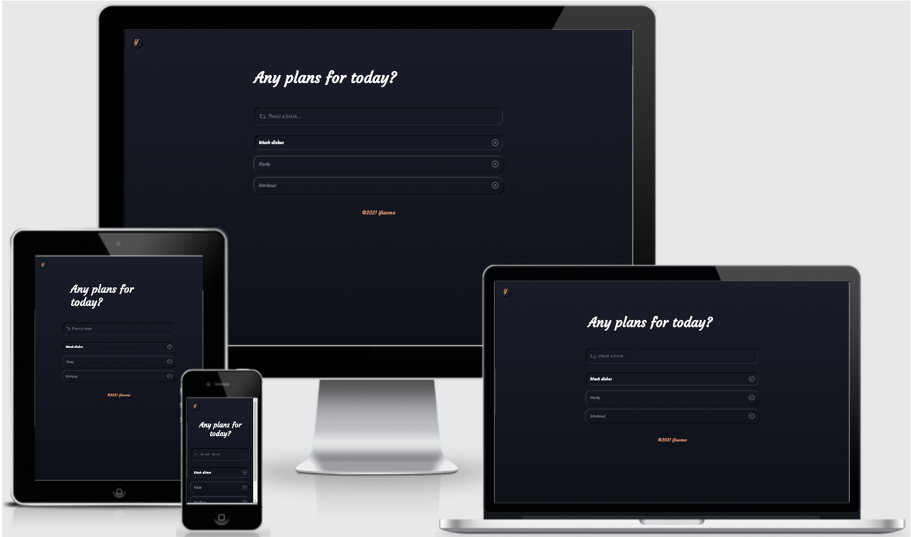

<h1 align="center">ReactJS Todo App</h1>

[View the live project here.](https://github.com/Yia0ma/reactjs_todo)

The one and only, beloved project of any junior developer - Todo App. Application helps you to track your daily goals and tasks.
<p align="center">
    
</p>


> It is designed to be responsibe and accessible on a range of devices.

---

## Table of Contents

- [User Experience](#user-experience-(ux))
- [Features](#features)
- [Technologies](#technologies)
- [Testing](#testing)
- [Deployment](#deployment)
- [How To Use](#how-to-use)
- [Licenses](#license)
- [Author Info](#author-info)

---

## User Experience (UX)

- ### User Stories

    1. As a Visitor, I want to easily understand the main purpose of the site and learn more about the developer.
    2. As a Visitor, I want to be able to easily navigate throught the site to find content.

- ### Design
    - #### Colour Palette
        - #1A1D28
        - #0D1017
        - #1B1E29
        - #E2946B
        - #6D767E
    - #### Typography
        - The Courgette font is the main font used on this site with Cursive as the fallback font in case for any reason the font isn't being imported into the site correctly.
---

## Features

- Resposive on all device sizes.

- Interactive elements.

---

## Technologies

### Languages

- [HTML5](https://en.wikipedia.org/wiki/HTML5)
- [CSS3](https://en.wikipedia.org/wiki/Cascading_Style_Sheets)
- [JavaScript](https://en.wikipedia.org/wiki/JavaScript)

### Frameworks, Libraries & Programs

- [Webpack](https://webpack.js.org/)
    - Webpack was used to build and bundle whole project into single javascript file.
- [React](https://reactjs.org/)
    - React was used to create fast, robust and modern user interface.
- [React Icons](http://react-icons.github.io/react-icons/)
    - React icons were used on the website to add icons for aesthetic and UX purposes.
- [Styled Components](https://styled-components.com/)
    - Styled components were used to intergrate all css syntax into javascript files.
- [Google Fonts](https://fonts.google.com/)
    - Google fonts were used to import the 'Courgette' font into project.
- [Git](https://git-scm.com/)
    - Git was used for version control.
- [GitHub](https://github.com/)
    - GitHub is used to store the projects code after being pushed from Git.

[Back To The Top](#table-of-contents)

---

## Testing

The W3C Markup Validator and W3C CSS Validator Services were used to validare every page of the project to ensure there were no syntax errors in the projects.

- [W3C Markup Validator](https://jigsaw.w3.org/css-validator/#validate_by_input)
- [W3C CSS Validator](https://jigsaw.w3.org/css-validator/#validate_by_input)

### Futher Testing

- The Website was tested on Google Chrome, Internet Explorer, Microsoft Edge and Safari browsers.
- The Website was viewed on a variety of devices such as Desktop, Laptop and Mobile.
- Friends and family members were asked to review the site and documentation to point out any bugs and/or user experience issues.

[Back To The Top](#table-of-contents)

---

## Deployment

- ### Netlify

    The project was deployed to Netlify and can be preview by the folowing link: [View the live project here.](https://yiaoma-reactjs-todo.netlify.app/)

[Back To The Top](#table-of-contents)

---

## How To Use

### Making a Local Clone

1. Log in to GitHub and locate the [GitHub Repository](https://github.com/Yia0ma/reactjs_todo)
2. Under the repository name, click "Clone or download".
3. To clone the repository using HTTPS, under "Clone with HTTPS", copy the link.
4. Open Git Bash
5. Change the current working directory to the location where you want the cloned directory to be made.
6. Type `git clone`, and then paste the URL you copied in Step 3.

```
$ git clone https://github.com/Yia0ma/reactjs_todo
```

7. Press Enter. Your local clone will be created.

```
$ git clone https://github.com/Yia0ma/reactjs_todo
> Cloning into `CI-Clone`...
> remote: Counting objects: 10, done.
> remote: Compressing objects: 100% (8/8), done.
> remove: Total 10 (delta 1), reused 10 (delta 1)
> Unpacking objects: 100% (10/10), done.
```

Click [Here](https://help.github.com/en/github/creating-cloning-and-archiving-repositories/cloning-a-repository#cloning-a-repository-to-github-desktop) to retrieve pictures for some of the buttons and more detailed explanations of the above process.

### Instalation

- After cloning the project to your local device, navigate to project directory, open terminal and execute script provided bellow to install all required dependecies.

```
    npm install
```

- Execute script listed bellow to start the project.

```
    npm start
```

[Back To The Top](#table-of-contents)

---

## License

MIT License

Copyright &copy; 2020 Artiom Kalugin

Permission is hereby granted, free of charge, to any person obtaining a copy of this software and associated documentation file (the "Software"), to deal in the Software without restriction, including without limitation the rights to use, copy, modify, merge, publish, distribute, sublicense, and/or sell copies of the Software, and to permit persons to whom the Software is furnished to do so, subject to the following conditions:

The above copyright notice and this permission notice shall be included in all copies or substantial portions of the Software.

THE SOFTWARE IS PROVIDED "AS IS", WITHOUT WARRANTY OF ANY KIND, EXPRESS OR IMPLIED, INCLUSING BUT NOT LIMITED TO THE WARRANTIES OF MERCHANTABILITY, FITNESS FOR A PARTICULAR PURPOSE AND NONINFRINGEMENT, IN NO EVENT SHALL THE AUTHORS OR COPYRIGHT HOLDERS BE LIABLE FOR ANY CLAIM, DAMAGES OR OTHER LIABILITY, WHETER IN AN ACTION OF CONTRACT, TORT OR OTHERWISE, ARISING FROM OUT OF OR IN CONNECTION WITH THE SOFTWARE OR THE USE OR OTHER DEALINGS IN THE SOFTWARE.

[Back To The Top](#table-of-contents)

---

## Author Info

- Email - a.o.kalugin@gmail.com
- LinkedIn - [Artiom Kalugin](https://www.linkedin.com/in/aokalugin/)

[Back To The Top](#table-of-contents)